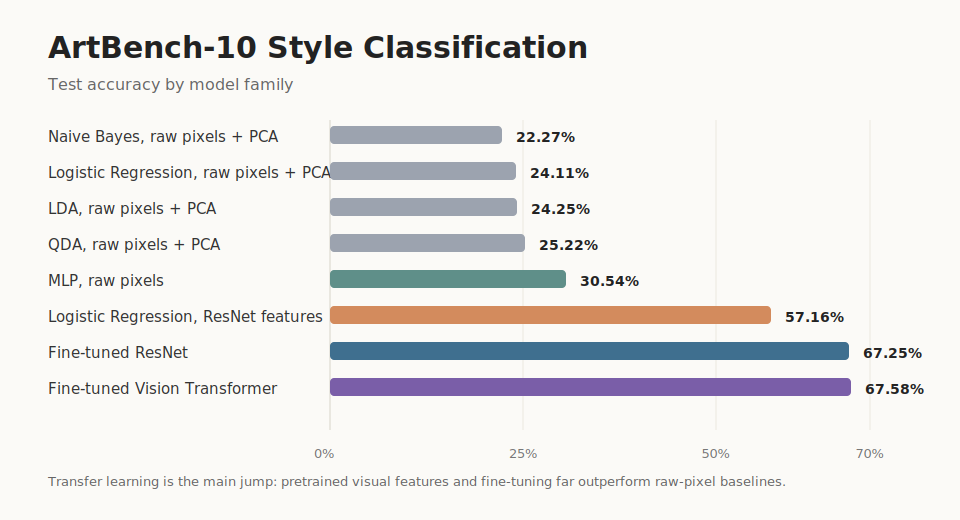

# WikiArt Style Classification

This project compares classical machine learning, multilayer perceptrons, convolutional transfer learning, and Vision Transformers for classifying paintings by artistic style.

The experiments use the [ArtBench-10 dataset](https://www.kaggle.com/datasets/alexanderliao/artbench10), a balanced artwork dataset with 10 style classes. The goal is not only to maximize accuracy, but to show how representation quality changes the difficulty of the task: raw pixels are weak, pretrained visual features are much stronger, and fine-tuned deep models give the best results.

## Highlights

- Built a full model comparison pipeline across raw-pixel PCA, classical classifiers, MLPs, ResNet, and Vision Transformer models.
- Evaluated models on a held-out 10,000-image test set.
- Used reproducible seeds, validation splits, classification reports, confusion matrices, and training curves.
- Found that transfer learning is the key improvement: raw-pixel methods stay near 22-31% accuracy, while ResNet and ViT reach about 67.5% test accuracy.

## Dataset

The notebooks expect the ArtBench-10 image-folder split at `data/artbench-10`. The dataset is not committed to the repository because of its size.

Follow [DATASET.md](DATASET.md) to download ArtBench-10, place it in the expected folder, and validate the local layout with:

```bash
python scripts/check_dataset.py
```

The final folder structure should look like this:

```text
data/
  artbench-10/
    train/
      art_nouveau/
      baroque/
      expressionism/
      impressionism/
      post_impressionism/
      realism/
      renaissance/
      romanticism/
      surrealism/
      ukiyo_e/
    test/
      art_nouveau/
      baroque/
      expressionism/
      impressionism/
      post_impressionism/
      realism/
      renaissance/
      romanticism/
      surrealism/
      ukiyo_e/
```

## Results



| Notebook | Model | Representation | Test accuracy | Test top-5 |
|---|---:|---|---:|---:|
| `01_linear_models.ipynb` | Gaussian Naive Bayes | Raw pixels + PCA | 22.27% | - |
| `01_linear_models.ipynb` | Logistic Regression | Raw pixels + PCA | 24.11% | - |
| `01_linear_models.ipynb` | Linear Discriminant Analysis | Raw pixels + PCA | 24.25% | - |
| `01_linear_models.ipynb` | Quadratic Discriminant Analysis | Raw pixels + PCA | 25.22% | - |
| `02_mlp.ipynb` | MLP | Raw pixels | 30.54% | - |
| `01_linear_models.ipynb` | Logistic Regression | ResNet-50 embeddings + PCA | 57.16% | - |
| `03_resnet.ipynb` | ResNet image classifier | Fine-tuned pretrained CNN | 67.25% | 96.99% |
| `04_vt.ipynb` | Vision Transformer | Fine-tuned pretrained ViT | 67.58% | 97.22% |

The best top-1 result is the Vision Transformer at 67.58% test accuracy, narrowly ahead of the fine-tuned ResNet. The strongest lesson is that pretrained visual representations matter much more than classifier choice: a simple linear model on ResNet embeddings is already far ahead of raw-pixel baselines.

## Notebook Guide

| File | Purpose |
|---|---|
| `01_linear_models.ipynb` | Establishes classical ML baselines using PCA on raw pixels, then improves them using ResNet-50 feature embeddings. |
| `02_mlp.ipynb` | Trains an MLP directly on image pixels and explores hyperparameter tuning with Keras Tuner. |
| `03_resnet.ipynb` | Fine-tunes a pretrained ResNet-style image classifier and evaluates accuracy, top-5 accuracy, and confusion patterns. |
| `04_vt.ipynb` | Fine-tunes a pretrained Vision Transformer and compares it against the CNN approach. |

Recommended reading order: start with `01_linear_models.ipynb` for baselines, then jump to `03_resnet.ipynb` and `04_vt.ipynb` for the strongest models.

## Key Takeaways

Raw-pixel features are not enough for this task. Classical models trained on PCA-compressed pixels perform above random chance, but they miss much of the high-level visual structure that separates artistic styles.

Pretrained CNN embeddings provide a large jump in performance. Logistic regression on ResNet-50 features reaches 57.16% test accuracy, showing that strong representation learning can make even simple classifiers competitive.

Fine-tuning deep pretrained models gives the best final performance. ResNet and ViT both reach about 67.5% test accuracy, with top-5 accuracy around 97%, meaning the correct style is usually among the model's highest-confidence candidates.

## Reproducing the Experiments

Create a Python environment and install the main dependencies:

```bash
python -m venv .venv
source .venv/bin/activate
pip install -r requirements.txt
```

On Windows PowerShell, activate the environment with:

```powershell
.\.venv\Scripts\Activate.ps1
pip install -r requirements.txt
```

If you plan to rerun the ResNet or Vision Transformer notebooks, use a GPU-enabled Python environment where PyTorch and TensorFlow can see your CUDA device. The saved notebook outputs are included, so reviewers can inspect the results without retraining every model locally.

Then:

1. Follow [DATASET.md](DATASET.md) to download ArtBench-10 into `data/artbench-10`.
2. Run `python scripts/check_dataset.py` to verify the folder layout and image counts.
3. Open the notebooks in order.
4. Run each notebook top to bottom.

## Project Structure

```text
.
|-- 01_linear_models.ipynb
|-- 02_mlp.ipynb
|-- 03_resnet.ipynb
|-- 04_vt.ipynb
|-- DATASET.md
|-- assets/
|   `-- model_comparison.svg
|-- requirements.txt
|-- README.md
|-- scripts/
|   `-- check_dataset.py
`-- .gitignore
```

Ignored local directories:

- `data/`: local dataset files.
- `results/`: cached PCA arrays, extracted features, and generated experiment artifacts.
- `logs/`: local training or job logs.

## Limitations and Next Steps

The strongest models still show a gap between training and test performance, especially the ResNet experiment, which reaches 100% training accuracy but 67.25% test accuracy. This suggests overfitting and domain shift between the training split and unseen test artists.

Future improvements could include stronger regularization, more systematic augmentation, cross-validation across artist splits, model ensembling, and a small inference demo for uploading a painting and viewing predicted style probabilities.

## What This Project Demonstrates

This repository demonstrates practical ML experimentation: building baselines, improving representations, comparing architectures, reading failure modes through confusion matrices, and communicating results clearly. It is a compact example of how model performance changes when moving from hand-engineered features to modern transfer learning.
